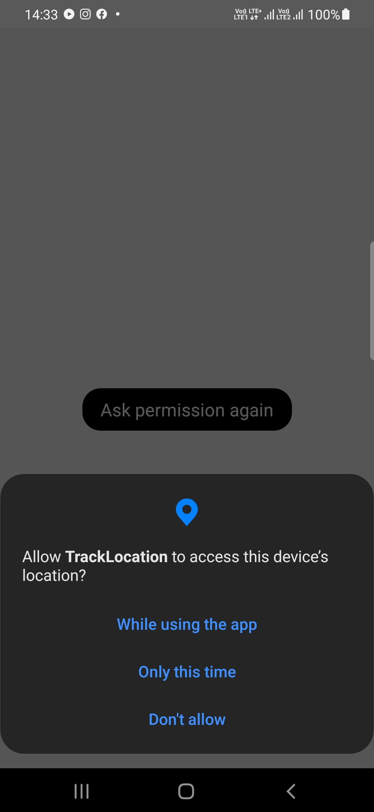
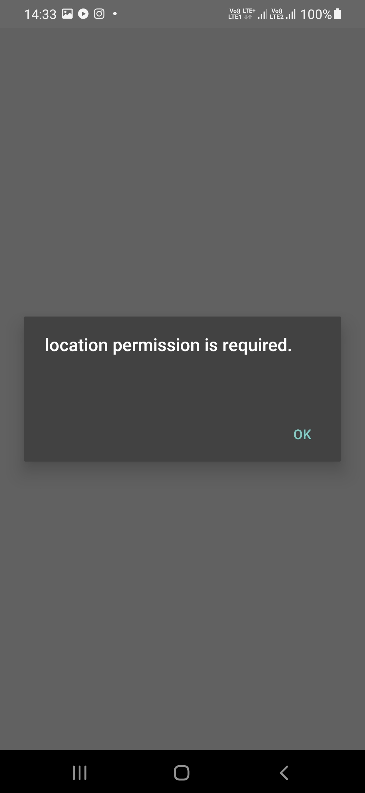
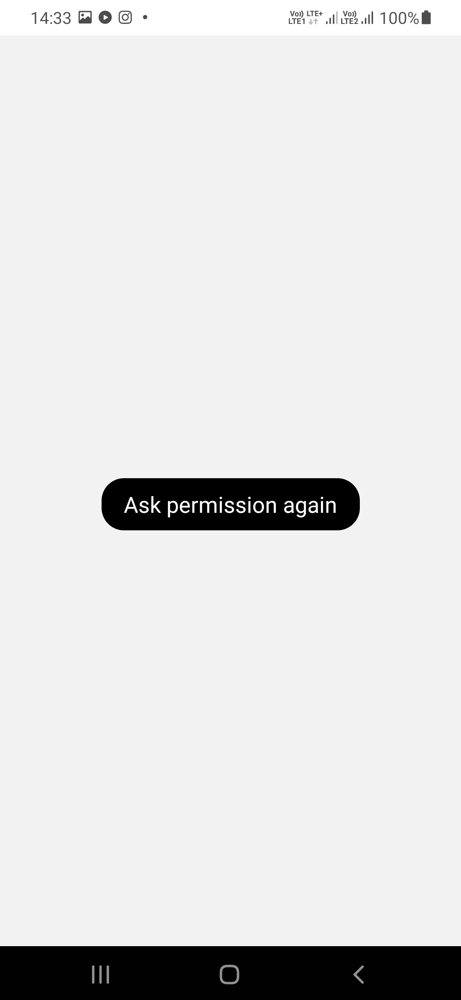
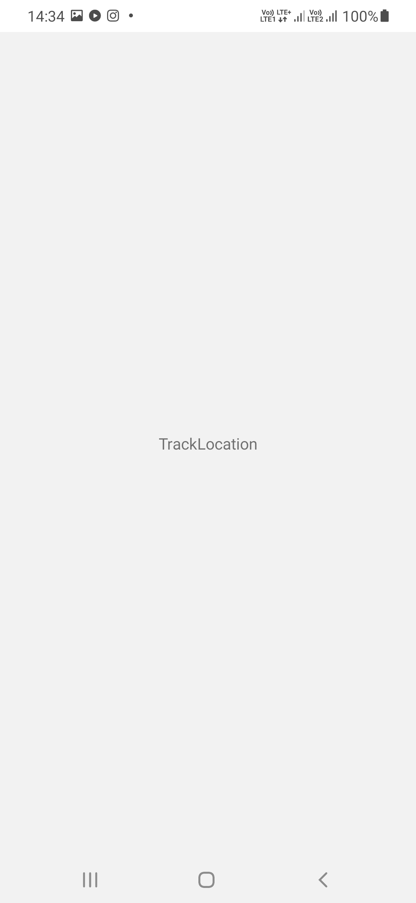

# TrackLocation-App 
This app is basically to track the location and show on web app.

used technology
firebase console
react-native

To use it follow the following steps:

clone the repo

run the following command:

npm install
npx react-native run-android

also You can download the apk file from below link  
https://drive.google.com/file/d/16_rTX5kOPIEI5qQCLFYTMnd7_k_38at2/view?usp=share_link

This app uses firebase for real time location

  

## Screenshots

#### Location Permission

#### LocationRequired

#### AskPermission

#### CaptureLocation

 